# Employee Service

The Employee Service manages the **Personal Data Sheet (PDS)** — CS Form No. 212 (Revised 2025) — which is the canonical source of truth for every government employee's profile. All other modules resolve employee identity and information through this service.

---

## Overview

| Item | Value |
|---|---|
| **Module short name** | `employee` |
| **Frontend app** | `apps/employee/` |
| **Backend service** | `services/employee-service/` |
| **Database** | PostgreSQL — `employee_db` |
| **Base API route** | `/api/employees` |
| **PDS standard** | CS Form No. 212 (Revised 2025) |

---

## Design Resources

| Resource | Link |
|---|---|
| ERD (draw.io) | [View on Google Drive](https://drive.google.com/file/d/1V8lP-Jf5Y2d8mxVqiILS7kFT-8qTGzrJ/view?usp=sharing) |
| PDS Form | ANNEX H-1 — CS Form No. 212 Revised 2025 — Personal Data Sheet.xlsx |
| Work Experience Sheet | ANNEX H-2 — CS Form No. 212 Attachment — Work Experience Sheet.docx |

---

## PDS Sections → Database Tables

The PDS is 4 pages. Each page maps to one or more database tables.

| Page | Field # | PDS Section | Table(s) |
|---|---|---|---|
| 1 | 1–21 | I. Personal Information | `personal_information` |
| 1 | 22–25 | II. Family Background | `family_backgrounds`, `spouses`, `children` |
| 1 | 26 | III. Educational Background | `educational_backgrounds` |
| 2 | 27 | IV. Civil Service Eligibility | `civil_service_eligibilities` |
| 2 | 28 | V. Work Experience | `work_experiences`, `work_experience_details` |
| 3 | 29 | VI. Voluntary Work | `voluntary_works` |
| 3 | 30 | VII. L&D Interventions / Training Programs | `training_programs` |
| 3 | 31 | VIII. Other Info — Special Skills & Hobbies | `skill_hobbies` |
| 3 | 32 | VIII. Other Info — Non-Academic Distinctions | `non_academic_distinctions` |
| 3 | 33 | VIII. Other Info — Organization Memberships | `organization_memberships` |
| 4 | 34–40 | Background Questions | `background_questions` |
| 4 | 41 | References | `references` |
| 4 | 42 | Declaration & Oath | (metadata on `employees` row) |
| 4 | — | Attachments | `attachments` |

---

## Entity Relationship Diagram

> Source: CS Form No. 212 (Revised 2025) — ANNEX H-1 & ANNEX H-2

```mermaid
erDiagram
    EMPLOYEE {
        uuid id PK
        string employee_no UK
        string employment_status
        datetime declared_at
        datetime created_at
        datetime updated_at
    }

    PERSONAL_INFORMATION {
        uuid id PK
        uuid employee_id FK
        string last_name
        string first_name
        string middle_name
        string extension_name
        date date_of_birth
        string place_of_birth
        enum sex_at_birth
        enum civil_status
        decimal height_m
        decimal weight_kg
        string blood_type
        string umid_id_no
        string pagibig_id_no
        string philhealth_no
        string philsys_number
        string tin_no
        string agency_employee_no
        string citizenship
        string citizenship_by
        string dual_citizenship_country
        string res_house_block_lot_no
        string res_street
        string res_subdivision_village
        string res_barangay
        string res_city_municipality
        string res_province
        string res_zip_code
        string perm_house_block_lot_no
        string perm_street
        string perm_subdivision_village
        string perm_barangay
        string perm_city_municipality
        string perm_province
        string perm_zip_code
        string telephone_no
        string mobile_no
        string email_address
    }

    FAMILY_BACKGROUND {
        uuid id PK
        uuid employee_id FK
        string father_last_name
        string father_first_name
        string father_middle_name
        string father_extension_name
        string mother_maiden_last_name
        string mother_first_name
        string mother_middle_name
    }

    SPOUSE {
        uuid id PK
        uuid family_background_id FK
        string last_name
        string first_name
        string middle_name
        string extension_name
        string occupation
        string employer_business_name
        string business_address
        string telephone_no
    }

    CHILD {
        uuid id PK
        uuid family_background_id FK
        string full_name
        date date_of_birth
    }

    EDUCATIONAL_BACKGROUND {
        uuid id PK
        uuid employee_id FK
        enum level
        string school_name
        string degree_course
        int period_from
        int period_to
        string highest_level_units_earned
        int year_graduated
        string scholarship_honors_received
    }

    CIVIL_SERVICE_ELIGIBILITY {
        uuid id PK
        uuid employee_id FK
        string eligibility_title
        decimal rating
        date date_of_examination
        string place_of_examination
        string license_number
        date license_valid_until
    }

    WORK_EXPERIENCE {
        uuid id PK
        uuid employee_id FK
        date date_from
        date date_to
        string position_title
        string department_agency_company
        string appointment_status
        bool is_government_service
    }

    WORK_EXPERIENCE_DETAIL {
        uuid id PK
        uuid work_experience_id FK
        string office_unit
        string immediate_supervisor
        string accomplishments
        text summary_of_duties
    }

    VOLUNTARY_WORK {
        uuid id PK
        uuid employee_id FK
        string organization_name
        string organization_address
        date date_from
        date date_to
        int number_of_hours
        string position_nature_of_work
    }

    TRAINING_PROGRAM {
        uuid id PK
        uuid employee_id FK
        string title
        date date_from
        date date_to
        int number_of_hours
        enum type
        string conducted_sponsored_by
    }

    SKILL_HOBBY {
        uuid id PK
        uuid employee_id FK
        string description
    }

    NON_ACADEMIC_DISTINCTION {
        uuid id PK
        uuid employee_id FK
        string description
    }

    ORGANIZATION_MEMBERSHIP {
        uuid id PK
        uuid employee_id FK
        string organization_name
    }

    BACKGROUND_QUESTIONS {
        uuid id PK
        uuid employee_id FK
        bool consanguinity_third_degree
        string consanguinity_third_degree_details
        bool consanguinity_fourth_degree
        string consanguinity_fourth_degree_details
        bool admin_offense
        string admin_offense_details
        bool criminal_charged
        string criminal_charged_details
        date criminal_charged_date_filed
        string criminal_charged_case_status
        bool convicted
        string convicted_details
        bool separated_from_service
        string separated_from_service_details
        bool election_candidate
        string election_candidate_details
        bool resigned_for_election
        string resigned_for_election_details
        bool immigrant_resident
        string immigrant_resident_country
        bool indigenous_group_member
        string indigenous_group_specification
        bool person_with_disability
        string pwd_id_no
        bool solo_parent
        string solo_parent_id_no
    }

    REFERENCE {
        uuid id PK
        uuid employee_id FK
        string full_name
        string office_residential_address
        string contact_no
        string email
    }

    ATTACHMENT {
        uuid id PK
        uuid employee_id FK
        string document_type
        string file_name
        string file_path
        string mime_type
        bigint file_size_bytes
        string description
        datetime uploaded_at
    }

    EMPLOYEE ||--|| PERSONAL_INFORMATION : "has"
    EMPLOYEE ||--|| FAMILY_BACKGROUND : "has"
    FAMILY_BACKGROUND ||--o| SPOUSE : "has"
    FAMILY_BACKGROUND ||--o{ CHILD : "has"
    EMPLOYEE ||--o{ EDUCATIONAL_BACKGROUND : "has"
    EMPLOYEE ||--o{ CIVIL_SERVICE_ELIGIBILITY : "has"
    EMPLOYEE ||--o{ WORK_EXPERIENCE : "has"
    WORK_EXPERIENCE ||--o| WORK_EXPERIENCE_DETAIL : "has"
    EMPLOYEE ||--o{ VOLUNTARY_WORK : "has"
    EMPLOYEE ||--o{ TRAINING_PROGRAM : "has"
    EMPLOYEE ||--o{ SKILL_HOBBY : "has"
    EMPLOYEE ||--o{ NON_ACADEMIC_DISTINCTION : "has"
    EMPLOYEE ||--o{ ORGANIZATION_MEMBERSHIP : "has"
    EMPLOYEE ||--|| BACKGROUND_QUESTIONS : "has"
    EMPLOYEE ||--o{ REFERENCE : "has"
    EMPLOYEE ||--o{ ATTACHMENT : "has"
```



---

## Enum Definitions

| Enum | Values |
|---|---|
| `sex_at_birth` | `Male`, `Female` |
| `civil_status` | `Single`, `Married`, `Widow/er`, `Separated`, `Solo Parent`, `Others` |
| `citizenship_by` | `By Birth`, `By Naturalization` |
| `educational_background.level` | `Elementary`, `Secondary`, `Vocational/Trade Course`, `College`, `Graduate Studies` |
| `training_program.type` | `Managerial`, `Supervisory`, `Technical`, `Foundation`, `Others` |

---

## Field Reference (CS Form No. 212 Revised 2025)

### Page 1 — I. Personal Information (Fields 1–21)

| Field # | Label | Column |
|---|---|---|
| 1 | Surname | `last_name` |
| 2 | First Name | `first_name` |
| — | Middle Name | `middle_name` |
| — | Name Extension (JR., SR) | `extension_name` |
| 3 | Date of Birth (dd/mm/yyyy) | `date_of_birth` |
| 4 | Place of Birth | `place_of_birth` |
| 5 | Sex at Birth | `sex_at_birth` |
| 6 | Civil Status | `civil_status` |
| 7 | Height (m) | `height_m` |
| 8 | Weight (kg) | `weight_kg` |
| 9 | Blood Type | `blood_type` |
| 10 | UMID ID No. | `umid_id_no` |
| 11 | PAG-IBIG ID No. | `pagibig_id_no` |
| 12 | PhilHealth No. | `philhealth_no` |
| 13 | PhilSys Number (PSN) | `philsys_number` |
| 14 | TIN No. | `tin_no` |
| 15 | Agency Employee No. | `agency_employee_no` |
| 16 | Citizenship | `citizenship`, `citizenship_by`, `dual_citizenship_country` |
| 17 | Residential Address | `res_*` columns |
| 18 | Permanent Address | `perm_*` columns |
| 19 | Telephone No. | `telephone_no` |
| 20 | Mobile No. | `mobile_no` |
| 21 | E-mail Address | `email_address` |

> **2025 changes vs 2017:** Field 10 renamed from *GSIS ID No.* to **UMID ID No.**; *SSS No.* removed; Field 13 is new **PhilSys Number (PSN)**; Field 5 is now **Sex at Birth**; civil status adds **Solo Parent**.

### Page 1 — II. Family Background (Fields 22–25)

| Field # | Label | Table / Column |
|---|---|---|
| 22 | Spouse (Surname, First Name, Middle Name, Extension, Occupation, Employer, Business Address, Telephone) | `spouses` |
| 23 | Children (Full Name, Date of Birth) | `children` |
| 24 | Father (Surname, First Name, Middle Name, Extension) | `family_backgrounds.father_*` |
| 25 | Mother's Maiden Name (Surname, First Name, Middle Name) | `family_backgrounds.mother_*` |

### Page 1 — III. Educational Background (Field 26)

| Level | Column value |
|---|---|
| Elementary | `Elementary` |
| Secondary | `Secondary` |
| Vocational / Trade Course | `Vocational/Trade Course` |
| College | `College` |
| Graduate Studies | `Graduate Studies` |

Columns per row: `school_name`, `degree_course`, `period_from`, `period_to`, `highest_level_units_earned`, `year_graduated`, `scholarship_honors_received`.

### Page 2 — IV. Civil Service Eligibility (Field 27)

Eligibility title covers: CES, CSEE, Career Service (Professional/Sub-Professional), RA 1080 (Board/Bar), Under Special Laws, Category II/IV, Uniformed Personnel eligibilities.

Columns: `eligibility_title`, `rating`, `date_of_examination`, `place_of_examination`, `license_number`, `license_valid_until`.

### Page 2 — V. Work Experience (Field 28)

Main PDS captures: `date_from`, `date_to`, `position_title`, `department_agency_company`, `appointment_status`, `is_government_service`.

> **2025 change:** Monthly salary and salary grade/step columns were **removed** from the main PDS form. Detailed work history (duties, accomplishments, immediate supervisor) is captured in the separate **Work Experience Sheet (ANNEX H-2)** stored in `work_experience_details`.

### Page 3 — VI. Voluntary Work (Field 29)

`organization_name`, `organization_address`, `date_from`, `date_to`, `number_of_hours`, `position_nature_of_work`.

### Page 3 — VII. L&D Interventions / Training Programs (Field 30)

> **2025 change:** Section renamed from "Training Programs" to **"Learning and Development (L&D) Interventions/Training Programs Attended"**.

`title`, `date_from`, `date_to`, `number_of_hours`, `type` (Managerial/Supervisory/Technical/etc), `conducted_sponsored_by`.

### Page 3 — VIII. Other Information (Fields 31–33)

Three separate tables, one row per item:
- **31** `skill_hobbies` — special skills and hobbies
- **32** `non_academic_distinctions` — recognition and awards
- **33** `organization_memberships` — professional/civic memberships

### Page 4 — Background Questions (Fields 34–40)

One `background_questions` row per employee. All questions are Yes/No with a details field.

| Field # | Question |
|---|---|
| 34a | Related by consanguinity or affinity within the **3rd degree** to the appointing/recommending authority? |
| 34b | Related within the **4th degree** (for LGU Career Employees)? |
| 35a | Ever found guilty of any **administrative offense**? |
| 35b | Ever **criminally charged** before any court? (+ Date Filed, Status of Case) |
| 36 | Ever **convicted** of any crime or violation? |
| 37 | Ever **separated from service** (resignation, retirement, dropped from rolls, dismissal, termination, end of term, finished contract, phased out)? |
| 38a | Ever been a **candidate in a national or local election** held within the last year (except Barangay)? |
| 38b | **Resigned from government service** during the 3-month period before last election to campaign? |
| 39 | Acquired status of **immigrant or permanent resident** of another country? |
| 40a | Member of any **indigenous group**? |
| 40b | **Person with disability**? (ID No.) |
| 40c | **Solo parent**? (ID No.) |

> Legal basis for 40: RA 8371 (Indigenous People's Act), RA 7277 as amended (Magna Carta for Disabled Persons), RA 11861 (Expanded Solo Parents Welfare Act).

### Page 4 — References (Field 41)

Three character references required (not related to applicant/appointee by consanguinity or affinity).

> **2025 change:** Column expanded from *Telephone No.* to **Contact No. and/or Email**.

Columns: `full_name`, `office_residential_address`, `contact_no`, `email`.

---

## Work Experience Sheet (ANNEX H-2)

A separate attachment to the main PDS. Captures narrative detail per work experience entry.

| Field | Column |
|---|---|
| Duration | (links back to `work_experiences.date_from` / `date_to`) |
| Position | `work_experience_details.office_unit` |
| Name of Office/Unit | `work_experience_details.office_unit` |
| Immediate Supervisor | `work_experience_details.immediate_supervisor` |
| Name of Agency/Organization and Location | (from parent `work_experiences.department_agency_company`) |
| List of Accomplishments and Contributions | `work_experience_details.accomplishments` |
| Summary of Actual Duties | `work_experience_details.summary_of_duties` |

---

## Clean Architecture Layers

```
Employee.Domain/
  Entities/
    Employee.cs
    PersonalInformation.cs
    FamilyBackground.cs
    Spouse.cs
    Child.cs
    EducationalBackground.cs
    CivilServiceEligibility.cs
    WorkExperience.cs
    WorkExperienceDetail.cs
    VoluntaryWork.cs
    TrainingProgram.cs
    SkillHobby.cs
    NonAcademicDistinction.cs
    OrganizationMembership.cs
    BackgroundQuestions.cs
    Reference.cs
    Attachment.cs
  Enums/
    SexAtBirth.cs
    CivilStatus.cs
    EducationalLevel.cs
    TrainingType.cs
    CitizenshipBy.cs
  Events/
    EmployeeCreatedEvent.cs
    EmployeeUpdatedEvent.cs
    EmployeeDeactivatedEvent.cs
  Repositories/
    IEmployeeRepository.cs

Employee.Application/
  Contracts/
    IEmployeeResolver.cs
  UseCases/
    Employees/
      CreateEmployee/
      UpdateEmployee/
      GetEmployee/
      ListEmployees/
      DeactivateEmployee/
    PersonalInformation/
    FamilyBackground/
    EducationalBackground/
    CivilServiceEligibility/
    WorkExperience/
    VoluntaryWork/
    TrainingPrograms/
    Skills/
    BackgroundQuestions/
    References/
    Attachments/

Employee.Infrastructure/
  Persistence/
    EmployeeDbContext.cs
    Migrations/
    Configurations/
  Repositories/
    EmployeeRepository.cs
  Storage/
    AttachmentStorageService.cs

Employee.API/
  Controllers/
    EmployeesController.cs
    PersonalInformationController.cs
    FamilyBackgroundController.cs
    EducationalBackgroundController.cs
    CivilServiceEligibilityController.cs
    WorkExperienceController.cs
    VoluntaryWorkController.cs
    TrainingProgramsController.cs
    SkillsController.cs
    BackgroundQuestionsController.cs
    ReferencesController.cs
    AttachmentsController.cs
```

---

## API Endpoints

All routes are prefixed with `/api/employees`.

### Employees

| Method | Route | Description |
|---|---|---|
| `GET` | `/` | List all employees (paginated) |
| `POST` | `/` | Create a new employee record |
| `GET` | `/{id}` | Get full employee profile |
| `PATCH` | `/{id}` | Update employee status |
| `DELETE` | `/{id}` | Deactivate employee |

### PDS Sections

| Section | Route |
|---|---|
| Personal Information | `/{id}/personal-information` |
| Family Background | `/{id}/family-background` |
| Spouse | `/{id}/family-background/spouse` |
| Children | `/{id}/family-background/children` |
| Educational Background | `/{id}/educational-backgrounds` |
| Civil Service Eligibility | `/{id}/civil-service-eligibilities` |
| Work Experience | `/{id}/work-experiences` |
| Work Experience Detail (ANNEX H-2) | `/{id}/work-experiences/{weId}/detail` |
| Voluntary Work | `/{id}/voluntary-works` |
| Training Programs (L&D) | `/{id}/training-programs` |
| Skills & Hobbies | `/{id}/skills` |
| Non-Academic Distinctions | `/{id}/distinctions` |
| Organization Memberships | `/{id}/memberships` |
| Background Questions | `/{id}/background-questions` |
| References | `/{id}/references` |
| Attachments | `/{id}/attachments` |

---

## Domain Events

| Event | Trigger |
|---|---|
| `EmployeeCreatedEvent` | New employee record saved |
| `EmployeeUpdatedEvent` | Any PDS section updated |
| `EmployeeDeactivatedEvent` | Employee marked inactive |

### `IEmployeeResolver` Contract

```csharp
public interface IEmployeeResolver
{
    Task<EmployeeDto?> ResolveAsync(Guid employeeId, CancellationToken ct = default);
}
```

---

## Attachments

Files are stored in object storage (MinIO in development, Azure Blob Storage / S3 in production). The `file_path` column stores the object key only — never raw file bytes.

| Document Type | Notes |
|---|---|
| Passport Photo | Required for PDS submission |
| Government-Issued ID | Passport, GSIS, SSS, PRC, Driver's License, etc. |
| CS Eligibility Certificate | Supporting document for Section IV |
| TOR / Diploma | Supporting document for Section III |
| Service Record | Supporting document for Section V |
| Work Experience Sheet | ANNEX H-2 (if submitted as scanned document) |
| Other | Miscellaneous attachments |

---

## Design Notes

- **UMID replaces GSIS** — The 2025 form uses UMID ID No. (Unified Multi-Purpose ID) in field 10, replacing the old GSIS ID No. The UMID consolidates SSS, GSIS, PhilHealth, and PAG-IBIG into one card. SSS No. as a standalone field was removed.
- **PhilSys Number** — Field 13 is new in 2025. PSN is the national ID number from the Philippine Identification System (PhilSys).
- **No salary in Work Experience** — Monthly salary and salary grade were removed from the 2025 PDS. Compensation data lives in the Payroll module, not the PDS.
- **Work Experience Sheet is optional** — ANNEX H-2 narrative detail (`work_experience_details`) is only required for positions where duties must be described. The parent `work_experiences` row is always required.
- **Background Questions are 1:1** — One `background_questions` row per employee. All 13 sub-questions are columns, not rows, because they are always answered together as a set on Page 4.
- **Addresses are embedded** — Residential and permanent addresses are flat columns in `personal_information` with `res_`/`perm_` prefixes. They are never reused by other entities.
- **References validation** — The PDS requires exactly 3 character references, not related by consanguinity or affinity. This is enforced at the application layer, not the database layer, to allow partial saves.
- **Spouse is optional** — A `spouses` row only exists for employees with `Married` civil status.
