# Modular Deployment Architecture

Prime HRM is designed to be sold in two ways:

1. **Full suite** — all modules deployed together as a complete HRM system
2. **Standalone module** — a single module (e.g., RSP only) deployed independently

This document defines how we achieve that flexibility without breaking either deployment scenario. Every developer must understand and follow these rules.

---

## Terms and Definitions

| Term | Definition |
|---|---|
| **Module** | A self-contained unit of the HRM system (e.g., RSP, Payroll). Each module has its own frontend app, its own backend service, and its own database. Modules can be deployed together or independently. |
| **Standalone deployment** | A scenario where only one module (plus the core infrastructure) is deployed — e.g., a customer buys only RSP without the rest of the system. |
| **Full suite** | All modules deployed together as a complete HRM system for a single customer. |
| **Microservice** | A backend service that handles exactly one module's business logic. Each microservice is independently deployable and owns its own database. In this project, each `.NET` service under `services/` is a microservice. |
| **Clean Architecture** | The layered structure used for every .NET backend service. Layers are: **Domain** (core business rules, no dependencies), **Application** (use cases, interfaces), **Infrastructure** (database, HTTP clients, message broker adapters), **API** (HTTP controllers, entry point). Inner layers never depend on outer layers. |
| **API Gateway** | A single entry point that sits in front of all backend microservices. The frontend always talks to the gateway — never directly to individual services. The gateway routes each request to the correct service. |
| **Identity Service** | The authentication and authorization service. Every module depends on it to verify who the user is and what they are allowed to do. It is always deployed regardless of which modules are active. |
| **Event Bus** | A messaging system (e.g., RabbitMQ, Azure Service Bus) that lets services communicate without calling each other directly. One service **publishes** a message; any other service that cares **subscribes** and receives it. If the subscriber is not deployed, the message is simply not delivered — the publisher never errors. |
| **Domain Event** | A message published to the Event Bus that describes something that already happened in the system (e.g., `CandidateHiredEvent`, `PayslipGenerated`). Named in past tense. Other services react to it asynchronously. |
| **Contract / Interface** | A C# `interface` declared in a module's `Application/Contracts/` folder that describes what data the module needs from another module. The module only depends on the interface — never on the actual other service. |
| **Adapter** | A class that implements a Contract interface. There are always two: a **real adapter** (makes an HTTP call to the actual service) and a **stub adapter** (returns null or empty data for standalone deployments). |
| **Stub** | The fake, do-nothing implementation of a Contract interface. Used when a module is deployed without its dependency. For example, `StubEmployeeResolver` returns null instead of calling the employee service. The consuming code must handle this gracefully. |
| **Event-Sourced Read Model** | The pattern used by the Reports module. Instead of querying other services at runtime, Reports subscribes to events from all modules and builds its own local, read-optimized database (called a **projection**). Reports only ever queries its own database — fast and decoupled. |
| **Projection** | A read-optimized copy of data built by listening to Domain Events. Used by the Reports module. For example, the "Employee Summary" projection is rebuilt every time an `EmployeeCreated` or `EmployeeUpdated` event arrives. |
| **Module Registry** | A list of which modules are active for a given deployment, returned by the API Gateway. The frontend reads this on startup to decide which routes to register and which navigation links to show. |
| **MassTransit** | A .NET library that provides a consistent API for publishing and consuming Domain Events. It works on top of RabbitMQ or Azure Service Bus so you can swap the broker without changing application code. |
| **PDS** | Personal Data Sheet — the standard government employee information form. The Employee Profile module is built around capturing and managing this data. |
| **PRIME-HRM** | Program to Institutionalize Meritocracy and Excellence in Human Resource Management — the CSC framework that defines the four pillars of HRM. Prime HRM as a product is named after this framework. |
| **Pillar** | One of the four PRIME-HRM focus areas: (1) Ranking, Selection and Placement, (2) Learning and Development, (3) Performance Management, (4) Rewards and Recognition. |
| **`IResolver`** | Shorthand for any Contract interface that follows the `I<X>Resolver` naming pattern (e.g., `IEmployeeResolver`, `IPositionResolver`). These are how modules declare cross-module data dependencies. |
| **`appsettings.json`** | The .NET configuration file. Module enable/disable flags (`Modules:Employee:Enabled`) live here, allowing the same codebase to behave differently depending on which modules are licensed for a given deployment. |

---

## Architecture Diagrams

### 1. Full System Overview

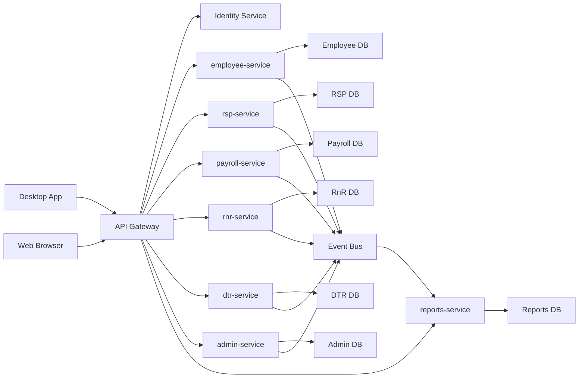

---

### 2. Cross-Module Contract Pattern

The Contract pattern is used whenever a module needs to **read data** from another module. The consuming module declares an interface for exactly what it needs, with two implementations: a real HTTP adapter and a stub for standalone deployments.

**RSP reads Employee data** (to display employee info on a hired applicant)

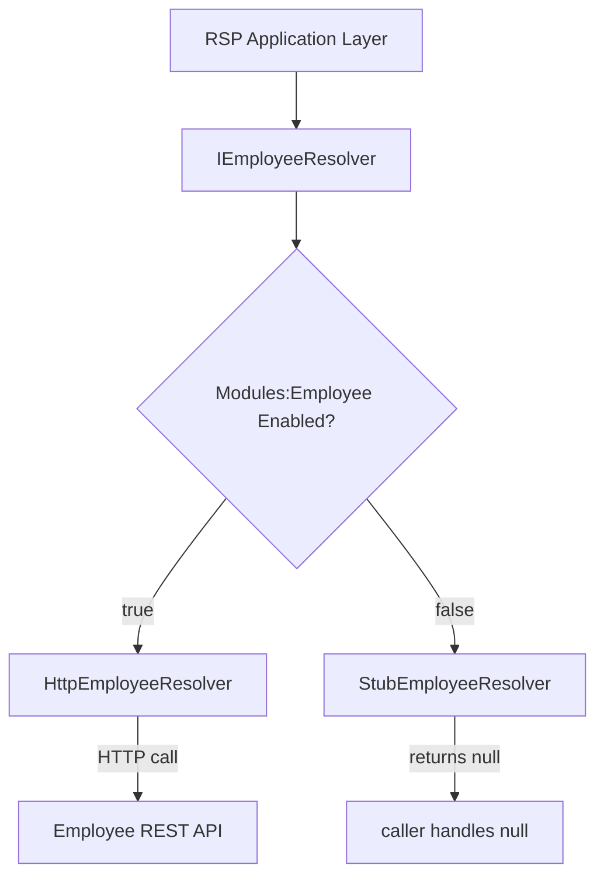

**Payroll reads Employee data** (to get employee info, salary grade, position for payslip computation)

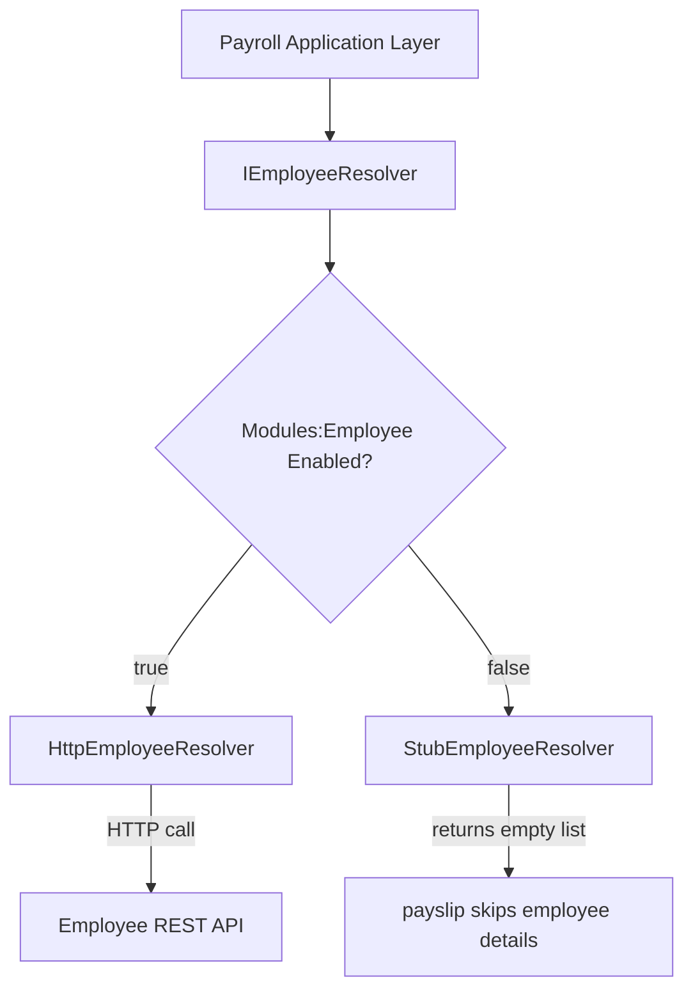

**RnR reads Employee data** (to get employee name, department, position for recognition record)


**DTR reads Employee data** (to get employee info for time record entries)

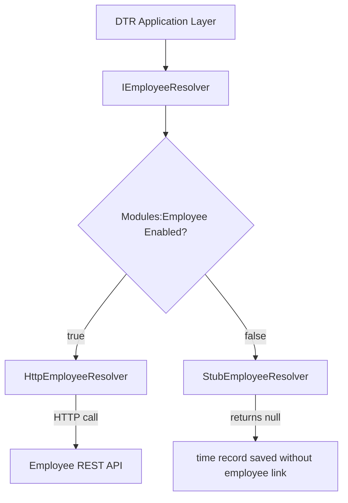

**Employee reads Admin data** (to look up departments and positions when creating a profile)

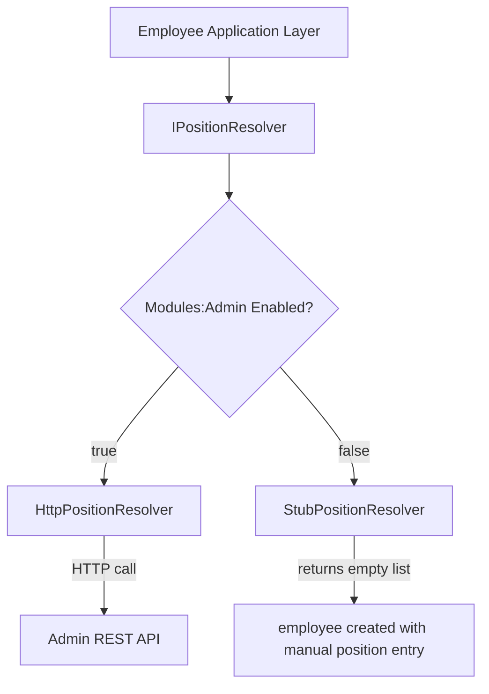

---

### 3. Cross-Module Event Flow

The Event pattern is used when an action in one module should **trigger a side effect** in another. The producing module publishes an event to the Event Bus. Consumers react only if they are deployed.

**RSP hires a candidate — Employee auto-creates the employee record**

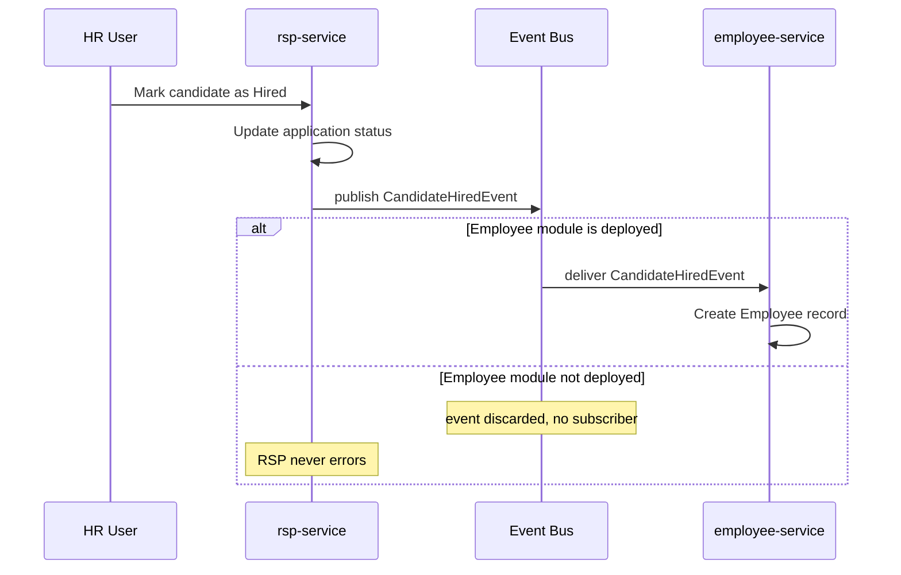

**Payroll generates a payslip — Reports updates its Payroll projection**

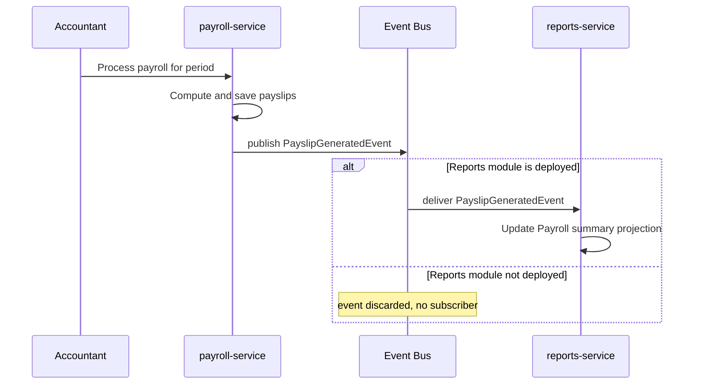

**RnR grants an award — Reports updates its RnR projection**

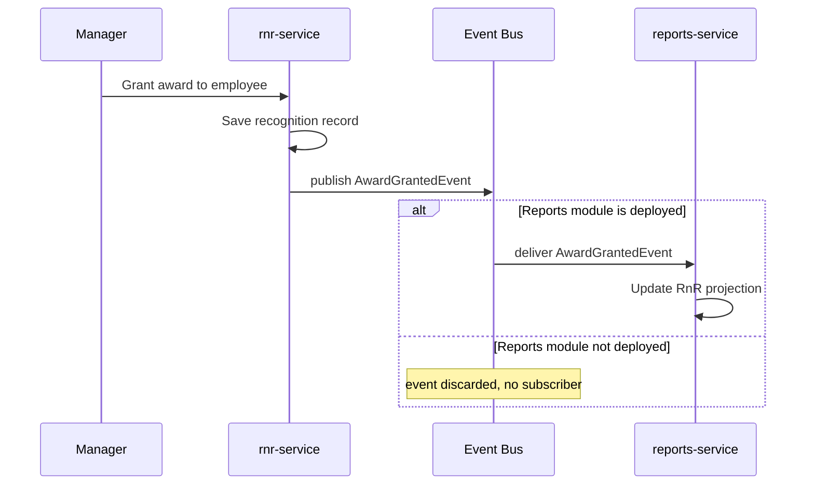

**DTR records time — Reports updates its DTR projection**

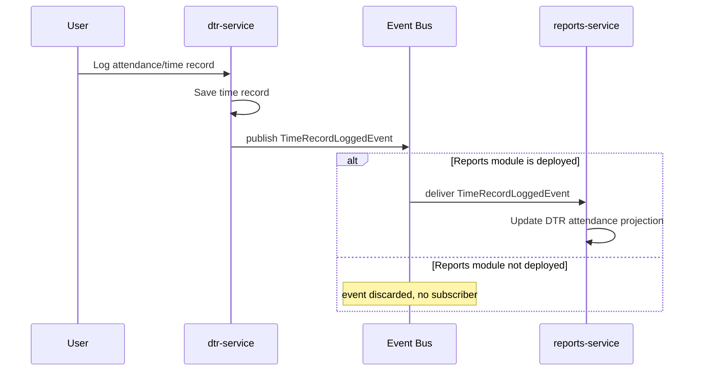

---

### 4. Deployment Scenarios

**Full Suite**

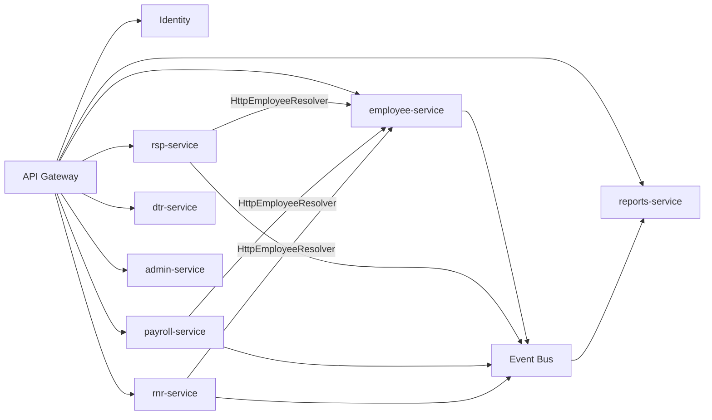

**RSP Standalone**

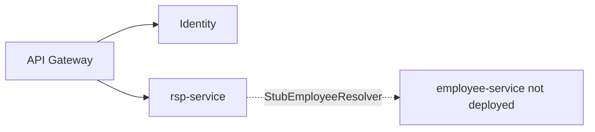

**RSP + Employee**

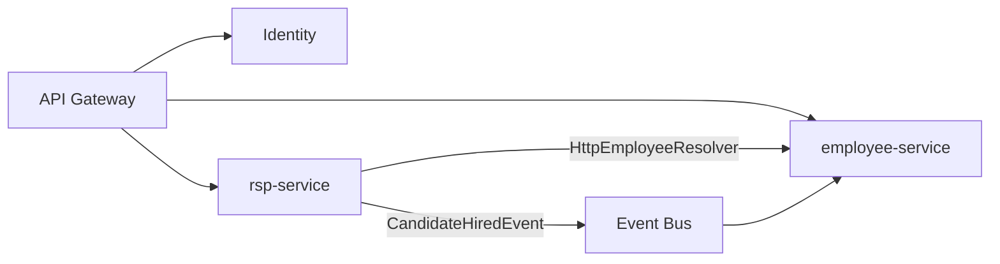

---

### 5. Frontend Module Registry Flow

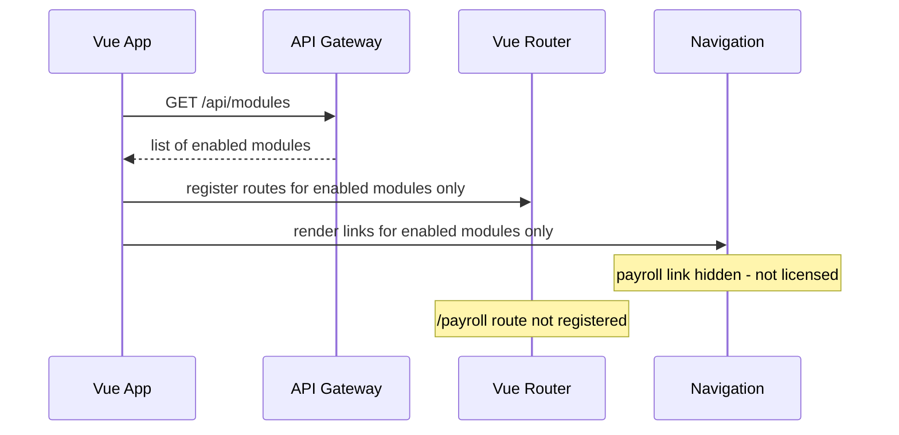

---

## The Core Principle: Modules Must Not Depend on Each Other Directly

If Module A directly imports code from Module B, or queries Module B's database, then Module A **cannot be deployed without Module B**. This is the root cause of all modular-deployment breakage.

The solution is strict boundary enforcement:
- No shared database across modules
- No direct service-to-service code imports
- No hard references to other modules' APIs — only optional, swappable contracts
- Cross-module communication happens through events or declared interfaces, never inline calls

---

## Always-On Core (Required by All Modules)

These services are **not optional**. Every deployment — full suite or standalone — always includes them:

| Service | Why Required |
|---|---|
| **Identity / Auth service** | Every module needs to authenticate users and check permissions |
| **API Gateway** | Routes frontend requests to the correct backend service |

Every module treats these as infrastructure, not as peer modules. They are never optional.

---

## Module Boundaries

Each module owns exactly:
- Its own database / schema
- Its own .NET service (`services/<module>-service/`)
- Its own Vue frontend app (`apps/<module>/`)

No module reads or writes another module's database — ever. This is the single most important rule.

### Modules

| Module | Short Name | Frontend App | Backend Service | PRIME-HRM Pillar |
|---|---|---|---|---|
| Employee Profile (PDS) | `employee` | `apps/employee/` | `services/employee-service/` | Core |
| Ranking, Selection and Placement | `rsp` | `apps/rsp/` | `services/rsp-service/` | 1st Pillar |
| Payroll System | `payroll` | `apps/payroll/` | `services/payroll-service/` | — |
| Rewards and Recognition | `rnr` | `apps/rnr/` | `services/rnr-service/` | 4th Pillar |
| Daily Time Record | `dtr` | `apps/dtr/` | `services/dtr-service/` | — |
| Administration | `admin` | `apps/admin/` | `services/admin-service/` | — |
| Reports | `reports` | `apps/reports/` | `services/reports-service/` | — |

### Cross-Module Dependency Map

This table defines which modules need data from other modules, and how.

| Module | Needs From | What It Needs | Pattern |
|---|---|---|---|
| RSP | Employee | Confirm hired candidate → create employee record | Event (`CandidateHiredEvent`) |
| Payroll | Employee | Employee info, salary grade, position for payslip | Contract (`IEmployeeResolver`) |
| Payroll | Administration | Org structure, position levels for salary computation | Contract (`IPositionResolver`) |
| RnR | Employee | Employee name, department, position for recognition | Contract (`IEmployeeResolver`) |
| DTR | Employee | Employee info for time record entries | Contract (`IEmployeeResolver`) |
| Reports | All modules | Aggregated data for dashboards and reports | Event-sourced read model (see below) |
| Administration | — | No dependencies on other modules | — |
| Employee | Administration | Department and position lookup when creating profiles | Contract (`IPositionResolver`) |

### The Reports Module: Special Case

Reports is the only module that intentionally needs data from all other modules. A naive implementation would query every service directly — making Reports impossible to deploy standalone.

The correct approach is an **event-sourced read model**:

1. Every module publishes domain events to the Event Bus (e.g. `EmployeeCreated`, `PayslipGenerated`, `DocumentFiled`, `CandidateHiredEvent`)
2. Reports service subscribes to all events and builds its **own local read-optimized database** — a projection
3. When Reports renders a dashboard, it queries only its own database — no runtime calls to other services

This means:
- Reports always works even if other services are temporarily down
- Reports deployed with only RSP will show RSP reports; other report sections show "no data"
- No cross-service joins at query time — fast reads

```
Event Bus
  ├── EmployeeCreated      → Reports builds Employee summary projection
  ├── PayslipGenerated     → Reports builds Payroll summary projection
  ├── CandidateHiredEvent  → Reports builds RSP funnel projection
  └── TimeRecordLogged     → Reports builds DTR attendance projection
```

Reports never calls other services — it only consumes their events.

### Standalone-Deployable Summary

| Scenario | Required Services |
|---|---|
| Full suite | All modules + Identity + Gateway + Event Bus |
| RSP only | `rsp-service` + Identity + Gateway |
| RSP + Employee | `rsp-service` + `employee-service` + Identity + Gateway |
| Payroll only | `payroll-service` + Identity + Gateway |
| DTR only | `dtr-service` + Identity + Gateway |
| Reports only | `reports-service` + Identity + Gateway + Event Bus (receives no events until other modules added) |
| Administration only | `admin-service` + Identity + Gateway |

---

## Cross-Module Data: The Contract Pattern

When a module needs data that belongs to another module, it **declares a contract (interface)** for what it needs — not a direct dependency on the other module.

### Example: RSP Needs Employee Data

RSP needs to link a hired candidate to an employee record. Instead of calling the employee service directly:

**Wrong approach (creates hard dependency):**
```csharp
// rsp-service — DO NOT DO THIS
var employee = await _employeeServiceClient.GetEmployeeAsync(id);
```

**Correct approach (contract + adapter):**

Step 1 — RSP defines what it needs, in RSP's own domain language:

```csharp
// services/rsp-service/src/Application/Contracts/IEmployeeResolver.cs
namespace RspService.Application.Contracts;

public interface IEmployeeResolver
{
    Task<RspEmployee?> FindByIdAsync(string employeeId, CancellationToken ct = default);
}

public record RspEmployee(string Id, string FullName, string Department);
```

Step 2 — Two adapters implement this interface:

**Full-suite adapter** — calls the real Employee service via HTTP:
```csharp
// services/rsp-service/src/Infrastructure/Adapters/HttpEmployeeResolver.cs
public class HttpEmployeeResolver : IEmployeeResolver
{
    public async Task<RspEmployee?> FindByIdAsync(string employeeId, CancellationToken ct = default)
    {
        // HTTP call to employee-service API
    }
}
```

**Standalone adapter** — used when RSP is deployed without Employee module:
```csharp
// services/rsp-service/src/Infrastructure/Adapters/StubEmployeeResolver.cs
public class StubEmployeeResolver : IEmployeeResolver
{
    public Task<RspEmployee?> FindByIdAsync(string employeeId, CancellationToken ct = default)
        => Task.FromResult<RspEmployee?>(null);
}
```

Step 3 — Registration is driven by configuration:
```csharp
// services/rsp-service/src/Infrastructure/DependencyInjection.cs
if (config.GetValue<bool>("Modules:Employee:Enabled"))
    services.AddHttpClient<IEmployeeResolver, HttpEmployeeResolver>(...);
else
    services.AddSingleton<IEmployeeResolver, StubEmployeeResolver>();
```

The RSP application layer never knows which adapter is active. It just calls `IEmployeeResolver` and handles null gracefully.

### Rules for Cross-Module Contracts

- The interface lives in the **consuming module** (`Application/Contracts/`), not the provider
- The interface only exposes what the consumer actually needs — not the full entity from the other module
- The consumer handles the case where the result is null or unavailable
- Both adapters must always exist: a real HTTP adapter and a stub

---

## Cross-Module Events: The Event-Driven Pattern

For side effects that cross module boundaries (e.g., "when a candidate is hired, notify the employee module to create a record"), use **domain events** — not direct calls.

### How It Works

The producing module emits an event. The consuming module optionally listens. If the consuming module isn't deployed, nobody listens and nothing breaks.

**RSP emits an event when a candidate is hired:**
```csharp
// services/rsp-service/src/Domain/Events/CandidateHiredEvent.cs
public record CandidateHiredEvent(
    string CandidateId,
    string FullName,
    string Position,
    DateOnly StartDate
);
```

**Employee module listens — only when deployed:**
```csharp
// services/employee-service/src/Application/EventHandlers/CandidateHiredHandler.cs
public class CandidateHiredHandler : IEventHandler<CandidateHiredEvent>
{
    public async Task HandleAsync(CandidateHiredEvent @event, CancellationToken ct)
    {
        // Create the employee record from the event data
    }
}
```

The message broker (e.g., RabbitMQ, Azure Service Bus) delivers the event only to whatever services are subscribed. If Employee isn't deployed, the event is simply undelivered or discarded — RSP never errors.

### When to Use Events vs. Contracts

| Situation | Pattern |
|---|---|
| Module A needs to **read data** from Module B synchronously | Contract + Adapter (IResolver) |
| Module A triggers an **action in Module B** as a side effect | Domain Event |
| Module A must **block until Module B responds** | Reconsider the design — try to avoid this |

---

## Frontend: Module-Aware Routing

The frontend must only show routes and navigation links for modules that are actually deployed and licensed for the current customer.

### Module Registry

Each deployment provides a list of active modules. The frontend fetches this on startup:

```ts
// src/lib/modules.ts (in apps/desktop/ or a shared gateway app)
export interface ModuleConfig {
  id: string
  name: string
  baseUrl: string  // URL where the module's frontend is served
  enabled: boolean
}

export async function fetchActiveModules(): Promise<ModuleConfig[]> {
  const response = await api.get<ModuleConfig[]>('/api/modules')
  return response.data.filter(m => m.enabled)
}
```

### Conditional Navigation

Navigation links and routes are only registered for active modules:

```ts
// src/router/index.ts
const modules = await fetchActiveModules()

const routes = [
  { path: '/', component: Dashboard },
  ...modules.map(mod => ({
    path: `/${mod.id}`,
    component: () => import(`../shells/${mod.id}.vue`),
  })),
]
```

Cross-module links in the UI must be conditional:

```vue
<!-- Only show "View Employee Profile" link if Employee module is active -->
<RouterLink v-if="isModuleActive('employee')" :to="`/employee/${employeeId}`">
  View Employee Profile
</RouterLink>
<span v-else class="text-muted-foreground">Employee module not available</span>
```

### Module Guard Composable

```ts
// packages/composables/src/useModules.ts
export function useModules() {
  const activeModules = inject<ModuleConfig[]>('activeModules', [])

  function isModuleActive(moduleId: string): boolean {
    return activeModules.some(m => m.id === moduleId && m.enabled)
  }

  return { activeModules, isModuleActive }
}
```

---

## Deployment Scenarios

### Full Suite

All services deployed, all modules enabled:

```yaml
# docker-compose.full.yml
services:
  identity-service:   ...
  api-gateway:        ...
  event-bus:          ...
  employee-service:   ...
  rsp-service:        ...
  payroll-service:    ...
  rnr-service:        ...
  dtr-service:        ...
  admin-service:      ...
  reports-service:    ...
```

Configuration:
```json
{
  "Modules": {
    "Employee": { "Enabled": true, "BaseUrl": "http://employee-service" },
    "RSP":      { "Enabled": true, "BaseUrl": "http://rsp-service" },
    "Payroll":  { "Enabled": true, "BaseUrl": "http://payroll-service" },
    "RnR":      { "Enabled": true, "BaseUrl": "http://rnr-service" },
    "DTR":      { "Enabled": true, "BaseUrl": "http://dtr-service" },
    "Admin":    { "Enabled": true, "BaseUrl": "http://admin-service" },
    "Reports":  { "Enabled": true, "BaseUrl": "http://reports-service" }
  }
}
```

### RSP Standalone

Only RSP deployed — no Employee module, no Payroll:

```yaml
# docker-compose.rsp.yml
services:
  identity-service:   ...
  api-gateway:        ...
  rsp-service:        ...
```

```json
{
  "Modules": {
    "Employee": { "Enabled": false },
    "RSP":      { "Enabled": true, "BaseUrl": "http://rsp-service" },
    "Payroll":  { "Enabled": false },
    "RnR":      { "Enabled": false },
    "DTR":      { "Enabled": false },
    "Admin":    { "Enabled": false },
    "Reports":  { "Enabled": false }
  }
}
```

RSP's `IEmployeeResolver` uses `StubEmployeeResolver`. Cross-module nav links in the frontend are hidden. Nothing breaks.

### RSP + Employee (common combination)

A customer who wants recruitment leading into employee onboarding:

```yaml
# docker-compose.rsp-employee.yml
services:
  identity-service:   ...
  api-gateway:        ...
  event-bus:          ...
  rsp-service:        ...
  employee-service:   ...
```

With Employee enabled, RSP's `HttpEmployeeResolver` is active. When a candidate is hired, the `CandidateHiredEvent` is delivered to `employee-service` which auto-creates the employee record.

---

## Rules for Developers

These rules are non-negotiable. Breaking them makes standalone deployment impossible.

### Backend Rules

1. **Never query another module's database.** Each service has its own database/schema. Cross-module data access goes through the HTTP adapter only.

2. **Never import a class from another service's project.** No project references between service projects. They are independently deployable — treat them like separate codebases.

3. **All cross-module dependencies must have a stub adapter.** If `Module A` needs `Module B`, `Module A` must always have a `Stub<X>` implementation that compiles and runs without `Module B` being present.

4. **Handle missing cross-module data gracefully.** If `IEmployeeResolver.FindByIdAsync()` returns null, the feature degrades gracefully — it does not throw.

5. **Cross-module side effects use events, not direct calls.** If a workflow in RSP should trigger something in Employee, publish a domain event. Do not call the employee service directly.

6. **Module configuration drives adapter registration.** Use `appsettings.json` `Modules:<Name>:Enabled` to switch between real and stub adapters. Never use `#if` preprocessor directives.

### Frontend Rules

1. **Never hard-import a component from another app.** Each app is independently built and deployed. There are no cross-app imports.

2. **All cross-module links must be guarded with `isModuleActive()`.** Never render a link to another module without checking if it is active.

3. **Pages must not assume other modules exist.** If a page shows related data from another module (e.g., "Hired Employee" from RSP), it must handle the case where that data is unavailable.

4. **Module routing is driven by the module registry from the API.** Never hardcode which modules are available in the frontend config.

---

## Adding a New Module

When adding a new HRM module, follow this checklist:

### Backend
- [ ] Create `services/<module>-service/` with Clean Architecture layers (API / Application / Domain / Infrastructure)
- [ ] Define `Application/Contracts/I<X>Resolver.cs` for every cross-module dependency
- [ ] Implement `Infrastructure/Adapters/Http<X>Resolver.cs` (real) and `Stub<X>Resolver.cs` (standalone)
- [ ] Register adapters conditionally via `Modules:<Name>:Enabled` config
- [ ] Publish domain events for any cross-module side effects
- [ ] Add module entry to the module registry API response
- [ ] Add a Docker Compose service entry in both `docker-compose.full.yml` and a standalone `docker-compose.<module>.yml`

### Frontend
- [ ] Create `apps/<module>/` following the new app checklist in `CLAUDE.md`
- [ ] Never reference other `apps/` — only `packages/`
- [ ] Guard all cross-module navigation links with `isModuleActive()`
- [ ] Handle null/unavailable cross-module data in components

---

## What This Gives Us

| Capability | How |
|---|---|
| Sell full HRM suite | Deploy all 7 modules + identity + gateway + event bus |
| Sell RSP only (1st Pillar) | Deploy rsp-service + identity + gateway only |
| Sell RSP + Employee | Add employee-service, flip `Modules:Employee:Enabled: true` |
| Sell RnR only (4th Pillar) | Deploy rnr-service + identity + gateway only |
| Add Reports later | Deploy reports-service + event bus, it backfills as events arrive |
| Add a module mid-contract | Customer upgrades, flip `Enabled: true` in config, redeploy |
| Upgrade one module | Deploy only that service — others untouched |
| Test a module in isolation | Spin up with stub adapters — no other services needed |
